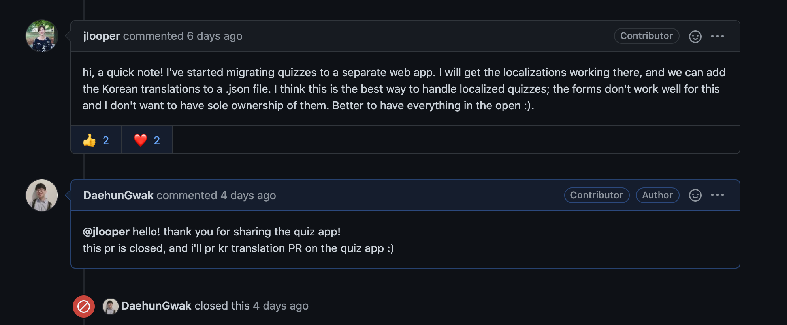
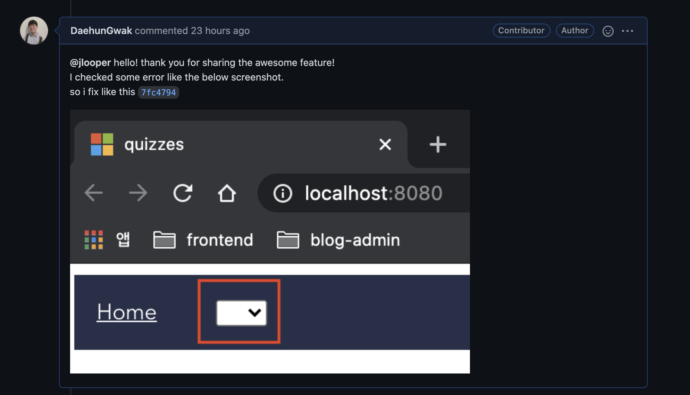

초보 개발자가 어떻게 [microsoft/Web-Dev-For-Beginner](https://github.com/microsoft/Web-Dev-For-Beginners) 에 컨트리뷰션을 하였는지 공유합니다.
위의 레포에서 `quiz-app` 이 vue로 개발을 시작하는 단계였고, 이 중 개선되면 좋다 생각되는
PR을 올렸는데 성공하여 기쁜나머지 정리합니다.

해당 글은 참여 했던 것 중 `quiz-app`의 vue 코드 관련 위주로 정리합니다. 다음 글에서
번역과 관련된 부분을 정리할 예정입니다. 🥳

## 📝 들어가며

[naver/fe-new](https://github.com/naver/fe-news) 월간 소식을 보다
[MS에서 웹을 시작하는 사람들을 위한 교육과정](https://github.com/microsoft/Web-Dev-For-Beginners)을 github에
공개했다는 소식을 듣게 되었습니다. 그래서 해당 repo에 들어가보니 이미 친절하게 한국어로 과정들이 번역되어 있었습니다.
위 과정을 통해 기본기를 많이 쌓을 수 있을 것 같아 공부하던 중, quiz는 번역이 안되어 있다는 사실을 알고
`나도 참여하면 컨트리뷰터에 간지(?)나게 이름을 올릴 수 있겠지` 마음과 함께 퀴즈 번역을 진행하게 되었습니다.



[퀴즈 번역 과정](https://github.com/microsoft/Web-Dev-For-Beginners/pull/102)을 참여하던 중 위와 같이 `quiz-app` 을
따로 만들 것이라는 사실을 공유 받았습니다. 지금 어짜피 작업할게 무용지물이 될 것이라 판단되어
바로 해당 앱 번역 참여로 노선을 바꾸는 것을 결심하였습니다.
그래서 해당 앱을 들어가보니 `vue` 로 개발을 진행 중이였고 아직 초기단계라 퀴즈 번역을 하면서 앱을 실행하던 중
개선 포인트들이 눈에보여 겁도 없이(?) 개선점을 개발하여 PR을 막무가내로 보내기 시작했습니다. (히히)

## 👨‍💻 개선 포인트

관련 PR 정리하자면 다음과 같습니다.

- [#141: Fix questions data re-rendering & Refactor home component (on quiz-app)](https://github.com/microsoft/Web-Dev-For-Beginners/pull/141)
- [#155: fix empty locale option when first created (quiz-app)](https://github.com/microsoft/Web-Dev-For-Beginners/pull/155)

아래에서 어떤 부분을 개선했는지 설명하겠습니다.

### 1. `data` -> `computed` 로 reactivity 개선


위를 보시면 언어를 바꾸었는데 퀴즈 문구들이 그대로인 것을 볼 수 있습니다.
그래서 Quiz 와 언어 옵션 기능이 있는 App 컴포넌트를 들여다 봤습니다.

```js
// Quiz.vue 일부
  data() {
    return {
      ...
      questions: this.$t("quizzes"),
    };

// App.vue 일부
  data() {
    return {
      locale: "en",
    };
  },
  watch: {
    locale(val) {
      this.$root.$i18n.locale = val;
    },
  },

```

언어 옵션을 선택할때는 App에 locale data가 바뀌고,
그 바뀐데이터를 `$root.$i18n.locale`에 다시 주입하는 형태입니다.
하지만 Quiz는 컴포넌트 생성 시점에만 questions 데이터 초기값으로 i18n의 quizzes 데이터를 내려주게되고,
이는 **locale 데이터 업데이트가 App 컴포넌트에서 발생했을 때 Quiz 컴포넌트로
reactivity를 발생시킬 수 없다**는 것을 나타냅니다.

따라서 Quiz 컴포넌트에 questions `data`를 `computed` 로 전환하면
업데이트된 locale로 반영된 i18n quizzes 데이터를 불러 올 수 있으므로 다음과 같이 고쳤습니다.

```js
// Quiz.vue 일부
  data() {
    return {
      ...
      // questions 삭제
    };
  },
  computed: { // 해당 부분 추가
    questions() {
      return this.$t("quizzes");
    },
  },
```

### 2. 하드 코딩된 목차 리스트 v-for로 개선

```js
// quiz-app/src/views/Home.vue 일부
<router-link class="link" to="quiz/1"
  >Lesson 1: Pre-Lecture Quiz</router-link
>
<router-link to="quiz/2">Lesson 1: Post-Lecture Quiz</router-link>
<router-link class="link" to="quiz/3"
  >Lesson 2: Pre-Lecture Quiz</router-link
>
<router-link class="link" to="quiz/4"
  >Lesson 2: Post-Lecture Quiz</router-link
>
<router-link class="link" to="quiz/5"
  >Lesson 3: Pre-Lecture Quiz</router-link
>
<router-link class="link" to="quiz/6"
  >Lesson 3: Post-Lecture Quiz</router-link
>
```

원본 코드는 위와 같이 router-link를 하나하나 하드코딩된 형태로 이루어져 있었습니다.
해당 부분은 번역된 json messages의 각 아이템을 순회하여 구성하면
json에 아이템이 변경되도 바로 반영될 수 있기 때문에 v-for로 수정하였습니다.

```js
// v-for을 이용한 quiz-app/src/views/Home.vue 개선
<router-link
  v-for="q in questions"
  :key="q.id"
  :to="`quiz/${q.id}`"
  class="link"
>
  {{ q.title }}
</router-link>
```

### 3. Home 컴포넌트 시작시 empty 현상 수정



[위의 코멘트](https://github.com/microsoft/Web-Dev-For-Beginners/pull/140#issuecomment-753474895)처럼
Home 컴포넌트 초기화 시 아무 값도 없어 코드를 보았습니다.
분석해보니 query parameter `loc`을 Home 컴포넌트 생성시 주입하고 있었는데,
일반적인 url로 접근시 쿼리 파라미터가 없기 때문에 나타나는 현상이였습니다.
그래서 다음과 같이 쿼리 파라미터 체크 로직을 추가하여 주입하였습니다.

```js
  created() {
    if (this.$route.query.loc) { // 해당 체크 추가
      this.locale = this.$route.query.loc;
    }
  },
```

## 🧐 마치며

2021년을 시작하며 해당 PR 을 성공시켰다는 것에 대단한 자존감을 뿜뿜느끼는 경험을 하여
이번 해는 너무 잘될거라는 마음이 들게 되었는데요 ㅎㅎ (비약적 해석..ㅎ)
사실 해당 **글을 쓴 목적은 저와 같은 초보 개발자도 오픈소스에 참여할 수 있다**는 용기를 주고 싶었습니다.
위의 내용을 보시면 사실 정말 기본적인 부분이고 누구나 Vue 튜토리얼을 읽어 보셨다면 가능하신 부분입니다.
초보자라도 오픈소스에 관심만 있으시다면 어떻게든 돌파구가 보이실테니,
컨트리뷰션에 망설이지 마시고 저와 같이 막무가내(?)로 질러보시길 권장합니다! (분명 좋은 경험이 되실거에요!)

언젠가는 사용하고 있는 기술이나 패키지에 대해 컨트리뷰션을 할 수 있는 
더 성장한 개발자가 되어있을거란 행복회로도 돌리게되는 계기도 되었습니다. 🤪

다음엔 번역은 어떤식으로 진행되었는지 조금 정리해보려 합니다. (좀 하자 게으른 친구야 ㅎㅎ)
우연한 기회로 microsoft 프로젝트에 참여하게 되서 기뻤고 파이팅 넘치는 한해가 되리라 믿으며 해당 글을 마칩니다.
(새해 복 많이 받으세요 🥳)
